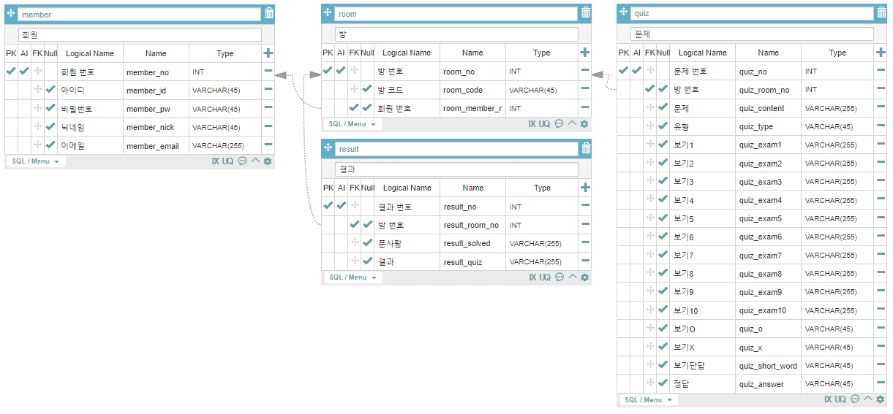

## 21.04.15(목)

### 기능 상세

- 문제 대분류
  - 객관식
  - 단답형 주관식
  - OX
- 결과 대분류
  - 점수형
    - 지속 제공되는 문제를 해결하며 점수를 매겨 총점을 계산해 출력
    - 객관식 팀전, 객관식 개인전, 단답형 팀전, 단답형 개인전
  - 생존형
    - 문제를 맞춘 사람들만 다음 문제에 참여하는 방식
    - OX 개인전
  - 시간제한형
    - 한정된 시간에 푼 문제의 수를 바탕으로 순위를 매겨 결과로 출력
    - 객관식 팀전, 단답형 팀전

- 방장과 출제자 구분
  - 방장과 출제자가 같을 필요는 없을 듯
  - 시간제한을 걸고 출제자에게 방장이 문제를 받아오는 방식도 고려
    - 즉각적인 문제 생성?
  - 게임의 시작을 출제자가 결정?
- 참여쟈 유형 분류
  - 관전자와 풀이자로 구분
  - 관전자는 문제와 채팅에 참여할 수 있으나 정답을 맞출 수 없음
    - 먼저 탈락한 사람들이 흥미를 잃지 않고 집중할 수 있게끔 하는 요소
  - 풀이자는 모든 행동에 제약이 없음

- OX퀴즈 상세
  - 참여자 중 O / X를 선택한 사람의 수와 선택 완료까지 남은 시간 등을 표시
  - (+) 정답자와 오답자의 닉네임을 출력하는 별도의 버튼 추가?

### DB

- '회원' 테이블에 '회원 번호' 추가 및 PK 지정
- '방 정보' 테이블을 '방' 테이블로 수정 및 방 번호 추가
- 몇 테이블의 Logical Name 수정

