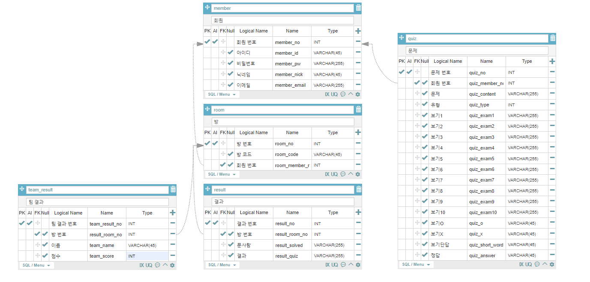

## 21.04.20(화)

### 컨설턴트님 미팅

- 볼륨을 더 키워라
- 기존에 존재하는 작품들과의 차이를 '팀전'에 두어야 할 듯
  - 팀 대항전을 구성하길 권함
- 참가자들도 다른 참가자의 목록을 볼 수 있게 하라
  - 서로간의 친목을 다지기 위함인데 왜 참여자들 간 확인을 못하게 하는지?
- 프로필의 활용성
  - 닉네임 및 프로필 사진 변경 외에도 다른 기능들을 늘려야
- 2차 교보재 때 서버 요구할 것

### DB

- 팀전 결과 출력을 위한 테이블 추가

### 중간 발표

- 기획 내용
- 핵심 기능 및 기존 시스템과의 차이점
- 기술 스택
- 지금까지 뭘 했고
- 앞으로 뭘 할 것인지

### 역할 재배분

- 백엔드
  - 한진영 - Quiz
  - 현수진 - 서버, 도커, 컨테이너 공부
  - 천영재 - 소켓 통신 관련 및 채팅 구현
- 프론트엔드
  - 이홍덕 - 로그인, 회원가입
  - 정현모 - 레이아웃
