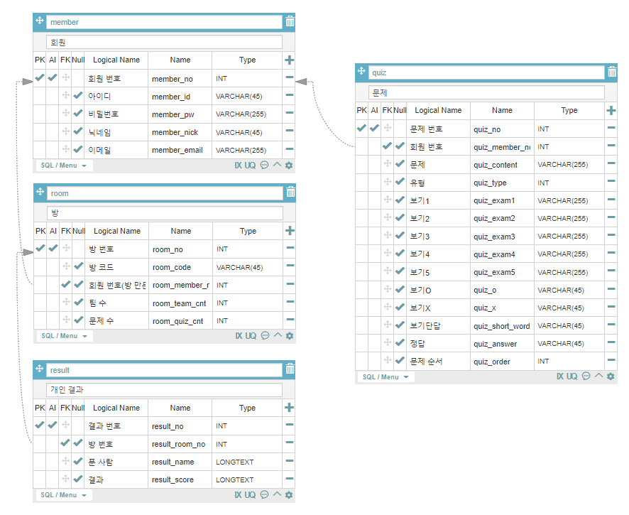

## 21.04.22(목)

### 기능 상세

- 채팅
  - 전체용과 팀용을 구분
- 팀 설정
  - 관리자가 설정할 수 있는 권한을 가짐
    - 관리자가 직접 팀에 팀원을 배정하거나
    - 참여자 본인이 원하는 팀에 들어갈 수 있도록 함

### DB

- '방'에 팀 수를 추가
- '방' 코드 끝에 한 자리 식별 코드를 붙여 방이 준비 완료됐음을 표시
  - True/False 역할을 할 한 자리 수를 더 붙이거나
  - 하나의 상태에만 코드를 덧붙여 코드의 length로 식별
- 그룹 당 문제 수 추가
- 팀 정보 추가
  - 팀전에서 해당 사용자가 몇 팀인지 등
- 문제에 순서 추가

