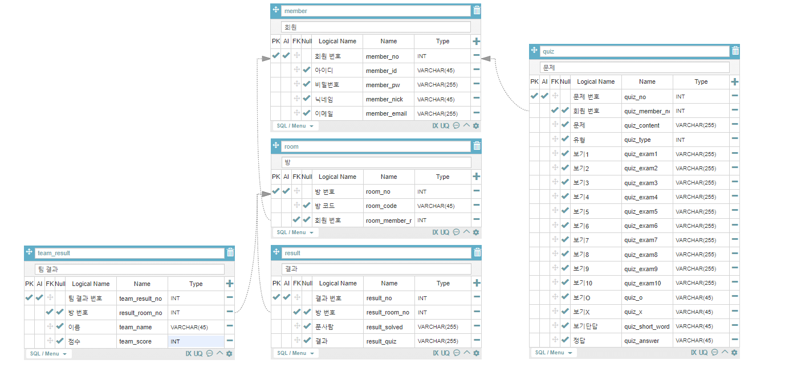

# 회의록

> 210412~210528 SSAFY 자율 프로젝트 Team A203 WHPH
>
> 일별 구분 없는 통합본

## 21.04.22(목)

### 기능 상세

- 채팅
  - 전체용과 팀용을 구분
- 팀 설정
  - 관리자가 설정할 수 있는 권한을 가짐
    - 관리자가 직접 팀에 팀원을 배정하거나
    - 참여자 본인이 원하는 팀에 들어갈 수 있도록 함

### DB

- '방'에 팀 수를 추가
- '방' 코드 끝에 한 자리 식별 코드를 붙여 방이 준비 완료됐음을 표시
  - True/False 역할을 할 한 자리 수를 더 붙이거나
  - 하나의 상태에만 코드를 덧붙여 코드의 length로 식별
- 그룹 당 문제 수 추가
- 팀 정보 추가
  - 팀전에서 해당 사용자가 몇 팀인지 등
- 문제에 순서 추가

## 21.04.21(수)

- 진행 상황 공유
  - 로그인 / 회원가입 레이아웃 완료
  - 레이아웃 작업 순서
    - 퀴즈 등록 - 마이페이지 퀴즈 목록 - 마이페이지 정보 수정 - 퀴즈 수정

### 와이어프레임

- 디테일 변경

### 기능 상세

- 점수 출력 방식
  - 상위 몇 명(팀)의 점수와 자신(팀)의 점수를 출력

## 21.04.20(화)

### 컨설턴트님 미팅

- 볼륨을 더 키워라
- 기존에 존재하는 작품들과의 차이를 '팀전'에 두어야 할 듯
  - 팀 대항전을 구성하길 권함
- 참가자들도 다른 참가자의 목록을 볼 수 있게 하라
  - 서로간의 친목을 다지기 위함인데 왜 참여자들 간 확인을 못하게 하는지?
- 프로필의 활용성
  - 닉네임 및 프로필 사진 변경 외에도 다른 기능들을 늘려야
- 2차 교보재 때 서버 요구할 것

### DB

- 팀전 결과 출력을 위한 테이블 추가

### 중간 발표

- 기획 내용
- 핵심 기능 및 기존 시스템과의 차이점
- 기술 스택
- 지금까지 뭘 했고
- 앞으로 뭘 할 것인지

### 역할 재배분

- 백엔드
  - 한진영 - Quiz
  - 현수진 - 서버, 도커, 컨테이너 공부
  - 천영재 - 소켓 통신 관련 및 채팅 구현
- 프론트엔드
  - 이홍덕 - 로그인, 회원가입
  - 정현모 - 레이아웃

## 21.04.19(월)

- 진행 상황 공유

### 와이어프레임

## 21.04.16(금)

### 기능 상세

- 방 입장 및 방 내 유저 관리
  - 입장할 때마다 그 방에 대한 세션을 가지고 확인
    - 참여자가 입장할 때마다 자신의 닉네임과 참여자 / 관전자 정보를 전송
    - 백에서 3가지 종류의 리스트를 통해 관리
  - 유저 정보의 변경 시 정보를 전송
    - 어떤 닉네임의 유저를
    - 어떤 팀으로 옮길 것인지 확인
  - 백단에서 이를 처리
    - 해당 닉네임의 유저를 이동
    - 중복 닉네임에 대한 처리는 고민사항
    - 이후 프론트단에서 정보를 모든 사용자에게 전송?
  - 아이디를 각자 부여하는 형태로 추가하여 처리하면 가능할 듯 보임
    - 백에서 autoincrement 요소를 추가하여 관리
- 방 코드
  - Hash 
    - 코드가 상당히 길어지는 문제
    - 사용자가 입력하고 들어가는 부분에 편의성이 부족해 보임
  - 랜덤한 6자리 문자
    - 알파벳과 숫자를 섞어 중복 없이 결정

## 21.04.15(목)

### 기능 상세

- 문제 대분류
  - 객관식
  - 단답형 주관식
  - OX
- 결과 대분류
  - 점수형
    - 지속 제공되는 문제를 해결하며 점수를 매겨 총점을 계산해 출력
    - 객관식 팀전, 객관식 개인전, 단답형 팀전, 단답형 개인전
  - 생존형
    - 문제를 맞춘 사람들만 다음 문제에 참여하는 방식
    - OX 개인전
  - 시간제한형
    - 한정된 시간에 푼 문제의 수를 바탕으로 순위를 매겨 결과로 출력
    - 객관식 팀전, 단답형 팀전

- 방장과 출제자 구분
  - 방장과 출제자가 같을 필요는 없을 듯
  - 시간제한을 걸고 출제자에게 방장이 문제를 받아오는 방식도 고려
    - 즉각적인 문제 생성?
  - 게임의 시작을 출제자가 결정?
- 참여쟈 유형 분류
  - 관전자와 풀이자로 구분
  - 관전자는 문제와 채팅에 참여할 수 있으나 정답을 맞출 수 없음
    - 먼저 탈락한 사람들이 흥미를 잃지 않고 집중할 수 있게끔 하는 요소
  - 풀이자는 모든 행동에 제약이 없음

- OX퀴즈 상세
  - 참여자 중 O / X를 선택한 사람의 수와 선택 완료까지 남은 시간 등을 표시
  - (+) 정답자와 오답자의 닉네임을 출력하는 별도의 버튼 추가?

### DB

- '회원' 테이블에 '회원 번호' 추가 및 PK 지정
- '방 정보' 테이블을 '방' 테이블로 수정 및 방 번호 추가
- 몇 테이블의 Logical Name 수정

## 21.04.14(수)

### 기능 상세

- 채팅 출력
  - 구름 형태의 메시지
  - 휘발성에 fadeout될 수 있도록
    - 이전 채팅이 남아있을 필요가 없으니 DB를 사용하지 않아도 될 듯

### 와이어프레임

- 틀 잡기 시작

### 기타

- 프로젝트 계획서 완성해 제출

## 21.04.13(화)

### 기능 상세

- 게임
  - 객관식, OX, 초성, 단답, 스피드 등
  - 채팅창과 정답창을 분리하지 않음
    - 정답을 맞추면 더 이상의 채팅이 불가
  - 객관식 보기는 최대 10개까지
    - 최대 한도 내에서 퀴즈 제작자의 재량껏 사용

### DB

- 문제 테이블 (변동 사항)
   - 방 코드 (FK)
   - 문제
   - 유형
   - 답 1~10
   - O / X 답
   - 단답 답

### 컨설턴트님 미팅

- 볼륨이 작을 수 있으니 백단의 최적화와 성능에 대해 어필하는 것이 좋을 듯
- 채팅 기능을 사용할 때 구름 형태의 출력 방식을 권유

### 기타

- 팀원들의 의견이 가장 중요
  - 컨설턴트님의 의견은 참고하되 절대적으로 따르지 않아도 됨
- 컨설턴트님과의 미팅이 필요할 때마다 언제든 호출

## 21.04.12(월)

### 주제 선정

- 블록체인 경비관리 시스템
- 밀키트 상품 거래 시스템(추가 구현)
- 이벤트 퀴즈 플랫폼 사이트  -- 결정
  - 방코드, 접속 시 비밀번호를 통한 입장
  - 퀴즈에 대한 정보는 사전 입력

### 역할 담당

- 백엔드
  - 한진영 - DBA
  - 천영재 - 백 기본 구현
  - 현수진 - 백 기본 구현
- 프론트엔드
  - 정현모 - 레이아웃 및 CSS 작업
  - 이홍덕 - 기본 백 연동

### 기능 명세

1. 로그인
2. 문제 생성
   - 로그인 유저에 한하여
3. 방 코드 생성 및 공유
4. 방 접속
   1. 비 로그인 시 닉네임을 입력하도록
   2. 로그인 시 회원 닉네임을 사용
5. 문제 풀기
6. 소켓 통신
7. 결과 화면

### DB

- 회원테이블
   - 아이디(PK)
   - 닉네임
   - 패스워드
   - 이메일

- 방코드 테이블
   - 호스트 ID (FK)
   - 방 코드 (PK)

- 문제 테이블
   - 방 코드 (FK)
   - 문제 & 답 & 유형

- 결과 테이블
   - 방 코드(FK)
   - 푼 사람
   - 결과

### 고려 사항

- 유저의 반응에 대해 서버가 얼마나 빠르게 반응할 수 있을 것인가?
- 트래픽 제어